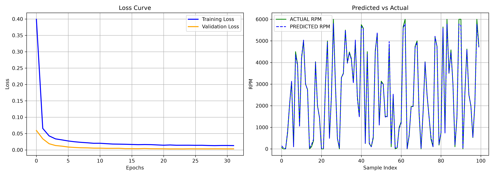

# Chapter 2: Data & Regression — Progress Report

This module handles dataset preparation, splitting, feature scaling, evaluation metrics, and complete regularization techniques for the end-to-end regression pipeline.

---

## 1. Module Structure

```text
DATA/
├── dataset.py                  # Dataset creation and train/validation/test splitting
├── scaler.py                   # MinMaxScaler and StandardScaler implementations
├── motor_results.png           # Final PMSM regression evaluation plot
├── motor_model_weights.npz     # Exported trained weights, biases & scaler parameters
└── README.md                   # Chapter 2 progress log and documentation
```

---

## 2. Chapter 2 Comprehensive Roadmap & Progress

| Topic | Sub-topics | Status | Implementation / Notes |
| :--- | :--- | :---: | :--- |
| **2.1 Dataset Logic** | Sample, Feature, Target, Shapes ($X, y$) | **Completed** | Solidified matrix dimensions and data representations. |
| **2.2 Train / Val / Test Split** | Ratios, Data Leakage Prevention | **Completed** | `split_dataset()` with strict ratio assertions and seed support. |
| **2.3 Feature Scaling** | Min-Max Normalization vs Standardization | **Completed** | `MinMaxScaler` and `StandardScaler` with inverse transformation. |
| **2.4 Linear Regression** | Single-neuron $y = XW + b$, Loss & Gradients | **Completed** | Verified analytical parameter recovery ($w \approx [3, -2, 5], b \approx 10$). |
| **2.5 Nonlinear Regression** | Hidden Layer, Non-linear Activation, Universal Approximation | **Completed** | 16-neuron Hidden Layer + Leaky ReLU achieved **96.6% loss reduction** over linear baseline. |
| **2.6 Underfitting & Overfitting** | Bias-Variance Tradeoff, Sweet Spot Dynamics | **Completed** | Demonstrated overfitting U-curve in `TEST/overfitting.py`. |
| **2.6.1 L2 Regularization (Ridge)** | Weight Decay, Shrinking Weight Magnitude | **Completed** | $dW += \lambda_2 W$, cut post-sweet-spot degradation in half (+29.7% $\to$ +15.6%). |
| **2.6.2 L1 Regularization (Lasso)** | Sparsity, Automatic Feature Selection | **Completed** | $dW += \lambda_1 \text{sign}(W)$, achieved **79.5% weight sparsity** by zeroing out connections. |
| **2.6.3 Inverted Dropout** | Co-adaptation Prevention, $1/(1-p)$ Scaling | **Completed** | Layer-level mask & scaling, improved best validation loss by **24%** (0.4871 $\to$ 0.3696). |
| **2.6.4 Early Stopping** | Patience, Automatic Training Halt, Weight Restoration | **Completed** | `get_weights()` and `set_weights()`, saved **94.7% compute time** (stopped at epoch 53/1000). |
| **2.7 Model Evaluation & Metrics** | MSE, RMSE, MAE, $R^2$ Score, Residual Analysis | **Completed** | Quantitative regression metrics implemented in `ANN/metrics.py`. |
| **Chapter 2 Final Project** | `motor_performance_predictor` Pipeline | **Completed** | End-to-end PMSM speed prediction: **$R^2 = 99.74\%$**, **$\text{MAE} = 39.66\text{ RPM}$**. |

---

## 3. Key Concepts Implemented

### Feature Scaling (`scaler.py`)
- **MinMaxScaler:** Squeezes features into $[0, 1]$ via $x' = \frac{x - x_{\min}}{x_{\max} - x_{\min} + \epsilon}$.
- **StandardScaler:** Centers data around zero with unit variance via $x' = \frac{x - \mu}{\sigma + \epsilon}$.
- **Data Leakage Rule:** Parameters ($\mu, \sigma, \min, \max$) are computed exclusively on `X_train` via `.fit()`. Validation and test sets are transformed using train parameters.
- **Inverse Transformation:** Maps scaled predictions back to physical units (e.g., RPM) via $\hat{y}_{\text{orig}} = \hat{y}_{\text{scaled}} \cdot (\sigma + \epsilon) + \mu$.

### Non-Linear Representation (`TEST/linear_vs_non-linear.py`)
- Verified the **Universal Approximation Theorem**:
  - Linear Model ($y = wx + b$): Plateaued at MSE $\approx 1.8778$ (Underfitting).
  - Non-Linear ANN (Hidden Layer + Leaky ReLU): Dropped MSE to $\approx 0.0640$ (96.6% error reduction).

### Regularization & Anti-Overfitting Arsenal (`ANN/basic_neural_training.py`)
1. **L2 Regularization (Weight Decay / Ridge):**
   - Loss Penalty: $\frac{\lambda_2}{2} \sum W^2$
   - Gradient Update: $dW += \lambda_2 W$
   - Effect: Smooths curves, shrinks weights toward zero without setting them to exact zero.
2. **L1 Regularization (Lasso):**
   - Loss Penalty: $\lambda_1 \sum |W|$
   - Gradient Update: $dW += \lambda_1 \text{sign}(W)$
   - Effect: Forces unimportant weights to exact $0.0$, creating sparse networks (achieved $79.5\%$ sparsity).
3. **Inverted Dropout:**
   - Training: Scales active activations by $\frac{1}{1-p}$ via random Bernoulli masks to preserve signal expectation $\mathbb{E}[A] = A$.
   - Backward: Gradients masked with the exact same scaled binary mask ($dA \cdot M$).
   - Inference/Evaluation: Dropout is completely bypassed with zero test-time overhead.
4. **Early Stopping:**
   - Monitors validation loss with configurable `patience` and `min_delta`.
   - Takes deep copies of neuron parameters via `get_weights()`.
   - Restores peak historical weights via `set_weights()` upon halting, guaranteeing the optimal Sweet Spot model.

### Quantitative Evaluation Metrics (`ANN/metrics.py`)
- **MSE (Mean Squared Error):** $\frac{1}{N} \sum (y - \hat{y})^2$
- **RMSE (Root Mean Squared Error):** $\sqrt{\text{MSE}}$, interprets error in physical units (RPM).
- **MAE (Mean Absolute Error):** $\frac{1}{N} \sum |y - \hat{y}|$, robust against outlier noise.
- **$R^2$ Score (Coefficient of Determination):** $1 - \frac{\text{SS}_{\text{res}}}{\text{SS}_{\text{tot}}}$, measures variance explained by the model.

---

## 4. Chapter 2 Final Project: PMSM Motor Speed Predictor

An end-to-end deep learning regression pipeline built completely from scratch using NumPy to predict the rotational speed (RPM) of a Permanent Magnet Synchronous Motor (PMSM).

### Dataset & Preprocessing
- **Source:** Kaggle PMSM dataset (sample size: 20,000 observations).
- **Input Features ($X \in \mathbb{R}^{20000 \times 6}$):** Direct and quadrature voltages/currents (`u_q`, `u_d`, `i_q`, `i_d`), ambient temperature (`ambient`), and coolant temperature (`coolant`).
- **Target ($y \in \mathbb{R}^{20000 \times 1}$):** Rotational speed (`motor_speed`, up to $\sim 6000\text{ RPM}$).
- **Split:** $70\%$ Train, $15\%$ Validation, $15\%$ Test.
- **Dual Standardization:** Both inputs $X$ and target $y$ are standardized using training statistics to guarantee fast convergence and numerical stability. Final predictions are mapped back to real RPM using `scaler_y.inverse_transform()`.

### Network Architecture & Training
- **Layer 1:** 6 Inputs $\to$ 32 Neurons (ReLU) + Inverted Dropout ($p = 0.10$)
- **Layer 2:** 32 Inputs $\to$ 16 Neurons (ReLU) + Inverted Dropout ($p = 0.05$)
- **Output Layer:** 16 Inputs $\to$ 1 Neuron (Linear)
- **Optimizer:** Adam ($\alpha = 0.001, \beta_1 = 0.9, \beta_2 = 0.999$)
- **Batch Size:** 64
- **Regularization:** Early Stopping with `patience=10`, `min_delta=0.0001`, and `restore_best_weights=True`.

### Final Evaluation Results

```text
==================================================
REGRESSION REPORTS (PMSM MOTOR SPEED PREDICTOR)
==================================================
  MSE   : 9190.0576
  RMSE  : 95.8648 RPM
  MAE   : 39.6635 RPM
  R^2   : %99.74 (Skor: 0.9974)
==================================================
```

* **Early Stopping in Action:** Halted at epoch 43; optimal weights automatically restored from **epoch 33** (`Val Loss = 0.001942`), saving over $57\%$ compute time.
* **Model Persistence:** Best weights, biases, and normalization parameters ($\mu_X, \sigma_X, \mu_y, \sigma_y$) are exported to `DATA/motor_model_weights.npz` using `np.savez()` for instant inference deployment.

### Evaluation Graph


